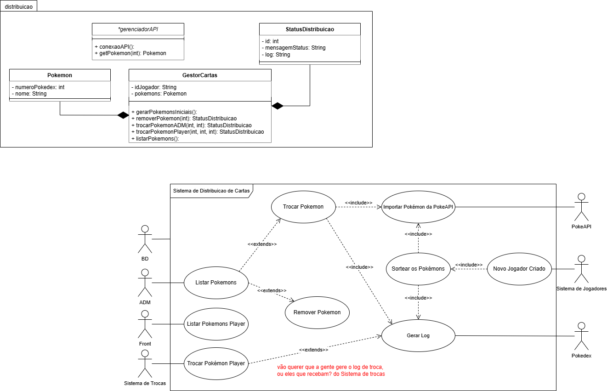

# 🎲 Sistema de Distribuição de Cartas


> Uma API REST para gerenciamento de sorteios e notificação de trocas de cartas Pokémons.

## Grupo
|**Nome**|**Matrícula**|
|--------|-------------|
|Felipe Ferreira|380|
|Felipe Silva Loschi|601|
|Henrique Oliveira Camppelo|367|
|Pedro Henrique Duarte|210|
|Pedro Henrique Ribeiro|529|
|Vitor Algusto|459|

______________________________________________________________


## 📋 Sobre o Projeto
Responsável por escolher cinco Pokémons aleatórios, disponibilizados pela [**PokéAPI**](https://pokeapi.co), e reservar para cada jogador cadastrado. Esse processo deve ser feito assim que o jogador realiza seu cadastro. A aplicação deve registrar as informações e fornecer uma interface para consulta de outras aplicações. Um mesmo jogador não deve ter Pokémons repetidos, mas o mesmo Pokémon pode ser distribuído para outros jogadores.


### 🧩 Funcionalidades Principais
- **Sorteio:** Algoritmo que seleciona 5 IDs aleatórios da PokeAPI.
- **Persistência de Time:** Salva o time sorteado vinculado ao jogador.
- **Geração de Logs:** Distribuição de Logs e Notificações de trocas.
- **Gestão Administrativa:** Permissão para ADM's poderem gerir os times vinculados.
---

## 🎯 Endpoints
| Método | Endpoint | Descrição | Entrada | Saida |
|--------|----------|-----------|---------|-------|
|GET     | /players/{id}/team | Lista todos os 5 pokémons de um jogador | - | {json de listagem} |
|POST    | /players/{id}/distribution | Sorteia os 5 pokémons iniciais para o jogador em questão | - | {json de criação} |
|DELETE    | /players/{id}/team/{pokemonId} | Remove 1 pokémon do jogador, se o jogador não possuir o pokémon, nenhuma operação é realizada e um Status de Distribuição diferente é retornado | - | {StatusDistribuição} |
|POST    | /players/{id}/team/{pokemonId} | Adiciona 1 pokémon no inventario do jogador, se o jogador já possuir o pokémon, ou nenhum espaço livre, nenhuma operação é realizada e um Status de Distribuição diferente é retornado | - | {StatusDistribuição} |
|PATCH    | /players/{id}/team | Realiza a troca no inventario do jogador, removendo o pokémon 1 e adicionando o pokémon 2, se houver algum tipo de conflito, um Status de Distribuição diferente é retornado | ```{removed_pokemon_id, add_poke_id}``` | {StatusDistribuição} |
|POST    | /trades | Realiza a troca no inventario do jogador 1 com o jogador 2, removendo o pokémon 1 e adicionando o pokémon 2 e vice-e-versa, se houver algum tipo de conflito, um Status de Distribuição diferente é retornado | ```{sender_id, sender_poke_id, receiver_id, receiver_poke_id}``` | {StatusDistribuição} |
|DELETE    | /players/{id} | Remove completamente um jogador do banco de dados | - | {json de remoção} |

### Exemplo Json Status de Distribuição
```json
{
  "status": 201,
  "message": "Operação realizada com sucesso",
  "data": {
    "operation": "ADDED",
    "pokemon_name": "Charizard",
    "is_shiny": true
  }
}
```

### Exemplo Json Listagem de Pokemons
```json
{
  "status": 200,
  "message": "Time adiquirido com sucesso",
  "data": {
    "operation": "LIST_TEAM",
    "team": [
      {
        "pokemon_name": "Pikachu",
        "is_shiny": true
      },
      {
        "pokemon_name": "Charizard",
        "is_shiny": false
      },
      {
        "pokemon_name": "Gengar",
        "is_shiny": false
      },
      {
        "pokemon_name": "Lucario",
        "is_shiny": false
      },
      {
        "pokemon_name": "Snorlax",
        "is_shiny": false
      }
    ]
  }
}
```

### Exemplo Json Remoção de Jogador
```json
{
  "status": 200,
  "message": "Jogador e seu time foram apagados do registro",
  "data": {
    "operation": "PLAYER_REMOVED",
  }
}
```

### Exemplo Json Criação de Jogador
```json
{
  "status": 201,
  "message": "Jogador cadastrado e time sorteado com sucesso",
  "data": {
    "operation": "PLAYER_CREATED",
    "draft_status": "SUCCESS",
    "draft_count": 5
  }
}
```

---

## 🏗️ Arquitetura e Padrão de Projeto
Para garantir a manutenibilidade e testabilidade, optamos por uma arquitetura baseada em **SOA - Service-Oriented Architecture**, *e o padrão de projeto ainda esta em debate*.

### 🔗 Diagrama de Uso e Classe


### 👷‍♂️ SOA
Adotamos **SOA** para estruturar o sistema de Distribuição de Cartas como um serviço autônomo. A classe GestorCartas utiliza a lógica de negócio, segregando responsabilidades críticas, o consumo de dados externos é isolado no GerenciadorAPI e a persistência no GerenciadorBD. Essa divisão garante que alterações na API externa ou no banco de dados não impactem o núcleo do sistema.

### 🏗️ Padrões de Projeto (Design Patterns)
Este projeto utiliza princípios de Arquitetura de Software para garantir um código modular, testável e de fácil manutenção. Abaixo estão os principais padrões utilizados:

#### Repository Pattern
O padrão Repository foi implementado para criar uma camada de abstração entre a lógica de negócios e a camada de acesso a dados (Banco de Dados).

Como foi usado: Classes como **PokemonRepository** e **UsuarioRepository** encapsulam as consultas complexas do **SQLAlchemy**.

Benefício ao Nosso Código: Isso permite que o restante da aplicação (como os Services e Controllers) não precise saber detalhes de como os dados são salvos ou buscados (SQL), facilitando a troca de banco de dados e a criação de testes unitários com mocks.

#### Adapter Pattern
O padrão Adapter foi utilizado para integrar a aplicação com serviços externos de forma desacoplada, entre as Classes internas do nosso código, as de conexões com o Banco de Dados e a **PokeAPI**.

Como foi usado: A classe **GestorAPI** atua como um adaptador para a **PokeAPI** externa. Ela adapta a resposta JSON complexa e "bruta" da API externa para os objetos de domínio da nossa aplicação **(Pokemon)**, e também há uma tradução interna de tipos de Objeto (**ORM (Object Realational Mapper)** <-> **Dominio (Nossas Classes)**).

Benefício ao Nosso Código: Se a API externa mudar suas rotas ou formato de resposta, precisamos alterar apenas a classe adaptadora, mantendo a regra de negócio da aplicação intacta.

 #### Singleton Pattern
O padrão Singleton foi aplicado para garantir o gerenciamento eficiente de recursos compartilhados.

Como foi usado: As classes **GestorAPI** e **GestorCartas** foram implementadas como Singleton. Pois isso garante que exista apenas uma única instância de cada uma dessas classes durante todo o ciclo de vida da aplicação.

Benefício ao Nosso Código: Evita a criação desnecessária de múltiplas instâncias de conexão e configurações de API, economizando memória e centralizando o ponto de acesso aos dados externos.

---
## 🧱 Aplicação do Princípio SOLIDD
### Single Responsability
- A classe **Pokemon** segue o Princípio da Responsabilidade Única, pois sua única função é encapsular os dados de um Pokémon.
- A classe **StatusDistribuicao** segue o Princípio da Responsabilidade Única, assim como a classe anterior pois somente encapsula os dados de um Log de resposta da Feature Distribuição de Cartas.

### Open/Close
- Seguindo este princípio, a classe **GestorCartas** é fechada porque seu código é estável, mas aberta porque podemos adicionar novas funcionalidades sem reescrever o que já existe.
- A classe **GerenciadorAPI** é fechada porque seu código não precisa de modificações de funcionalidade, porem, se necessário é possível adicionar mais métodos de usos para a PokeAPI.

### Liskov Substitution
- *Como nossa Feature não possui nenhuma relação de herança entre as classe, portanto não há como aplicar este principio.*

### Interface Segregation
- A classe **GerenciadorAPI** é pequena e específica para a leitura de dados. Isso evita que as classes sejam forçadas a implementar métodos que não utilizam, como de escrita ou deleção.

### Dependency Inversion
- A classe **GestorCartas** não depende de uma implementação concreta de como buscar um Pokémon. Em vez disso, ela depende da abstração **GerenciadorAPI**.

### Demeter
- No momento que a classe **GestorCartas** possui um objeto da classe **GerenciadorAPI** ele aplica o principio de Demeter ao só utilizar métodos próprios, ou de objetos que foram passados como parâmetro.
